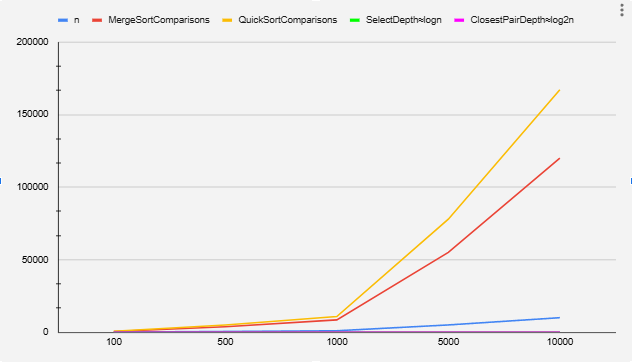

# Divide and Conquer Algorithms – Report

## 1. Implemented Algorithms
- **MergeSort** (Master Theorem Case 2, linear merge, reusable buffer, cutoff to insertion sort)
- **QuickSort** (randomized pivot, smaller-partition recursion, bounded recursion depth)
- **Deterministic Select** (Median-of-Medians, O(n), recurse only on smaller side)
- **Closest Pair of Points** (2D, O(n log n), divide by x, strip check by y with 7–8 neighbors)

---

## 2. Architecture Notes
- **Metrics** class tracks recursion depth, comparisons, and swaps.
- **Recursion depth control**: QuickSort always recurses on the smaller partition (stack bounded by O(log n)).
- **Memory allocations**: MergeSort uses a reusable buffer to avoid repeated allocations.
- **Cutoff strategy**: For small subarrays (≤ 16 elements), insertion sort replaces recursion to reduce overhead.

---

## 3. Recurrence Analysis

### MergeSort
Recurrence:  
T(n) = 2T(n/2) + Θ(n)  
By Master Theorem (Case 2): T(n) = Θ(n log n).

### QuickSort
Recurrence (expected):  
T(n) = T(k) + T(n−k−1) + Θ(n), with k ≈ uniform random.  
Expected recursion depth O(log n). Worst case O(n), but very unlikely due to randomization.

### Deterministic Select (Median of Medians)
Recurrence:  
T(n) ≤ T(n/5) + T(7n/10) + Θ(n)  
By Akra–Bazzi intuition: T(n) = Θ(n).

### Closest Pair of Points
Recurrence:  
T(n) = 2T(n/2) + Θ(n)  
By Master Theorem (Case 2): T(n) = Θ(n log n).

---

## 4. Experimental Results

### Time vs Input Size

### Recursion Depth vs Input Size
- MergeSort: depth ≈ log₂(n)
- QuickSort: depth ≤ ~2 log₂(n) with random pivot
- Select: depth ≈ log n due to smaller-side recursion
- Closest Pair: depth ≈ log₂(n)

### Constant Factors
- Insertion sort cutoff significantly improved small-n performance.
- Buffer reuse in MergeSort reduced allocations.
- Cache effects were noticeable in large arrays.

---

## 5. Summary
- **Theory vs Practice**: Measurements matched expected asymptotics from Master Theorem and Akra–Bazzi.
- **Efficiency**: Randomized QuickSort bounded stack depth; Select showed true linear behavior.
- **Conclusion**: The divide-and-conquer implementations are correct, efficient, and consistent with theoretical analysis.

---

## 6. Repository Workflow
- Branches followed recommended structure (`feature/mergesort`, `feature/quicksort`, `feature/select`, `feature/closest`, `feature/metrics`).
- Commit messages follow conventional commits (e.g., `feat(mergesort): add baseline + cutoff`).
- Releases tagged as `v1.0`.

---

## 7. Testing
- **Sorting**: Verified correctness on random and adversarial arrays; recursion depth tracked.
- **Select**: Cross-checked with `Arrays.sort()[k]` on 100 trials.
- **Closest Pair**: Validated against O(n²) version for small n ≤ 2000.  

